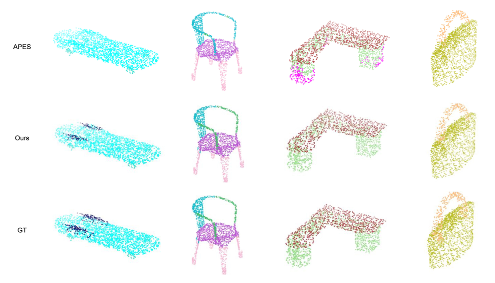

# REPS: Reconstruction-based Point Cloud Sampling

### [Paper](https://arxiv.org/abs/2403.05047)| [**Project Page**](https://github.com/hitcslj/REPS)

Official implementation of REPS: Reconstruction-based Point Cloud Sampling

Guoqing Zhang, Wenbo Zhao, [Jian Liu](https://hitcslj.github.io/), Xianming Liu


<p align="center"> All Code will be released soon... 🏗️ 🚧 🔨</p>

Abstract: *Sampling is widely used in various point cloud tasks as it can effectively reduce resource consumption. Recently, some methods have proposed utilizing neural networks to optimize the sampling process for various task requirements. Currently, deep downsampling methods can be categorized into two main types: generative-based and score-based. Generative-based methods directly generate sampled point clouds using networks, whereas score-based methods assess the importance of points according to specific rules and then select sampled point clouds based on their scores. However, these methods often result in noticeable clustering effects in high-intensity feature areas, compromising their ability to preserve small-scale features and leading to the loss of some structures, thereby affecting the performance of subsequent tasks. In this paper, we propose REPS, a reconstruction-based scoring strategy that evaluates the importance of each vertex by removing and reconstructing them using surrounding vertices. Our reconstruction process comprises point reconstruction and shape reconstruction. The two aforementioned reconstruction methods effectively evaluate the importance of vertices by removing them at different scales for reconstruction. These reconstructions ensure that our method maintains the overall geometric features of the point cloud and avoids disturbing small-scale structures during sampling. Additionally, we propose the Global-Local Fusion Attention (GLFA) module, which aggregates local and global attention features of point clouds, ensuring high-quality reconstruction and sampling effects. Our method outperforms previous approaches in preserving the structural features of the sampled point clouds. Furthermore, abundant experimental results demonstrate the superior performance of our method across various common tasks.*

<div align=center>

</div>

## PointSeg results
Visualizations of segmentation results on the ShapeNetPart dataset.
<p align="center">
    
</p>

## Point sampling results
Qualitative comparison for the sampling of 128 points from input point clouds with 1024 points.
<p align="center">
    
</p>

## BibTeX

```bibtex
@article{zhang2024reps,
 title={REPS: Reconstruction-based Point Cloud Sampling},
 author={Zhang, Guoqing and Zhao, Wenbo and Liu, Jian and Liu, Xianming},
 journal={arXiv preprint arXiv:2403.05047},
 year={2024}
}
```